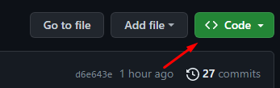
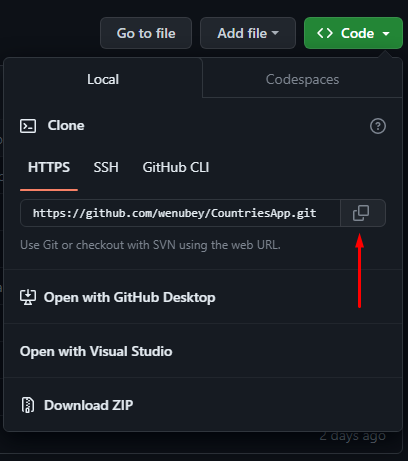
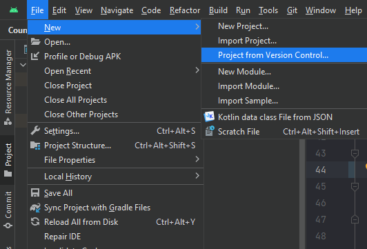
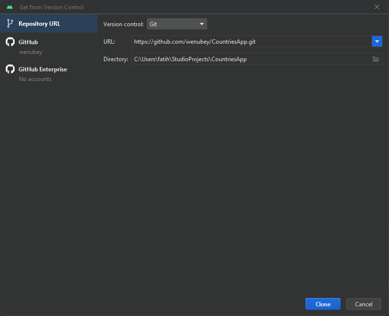
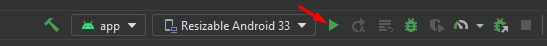
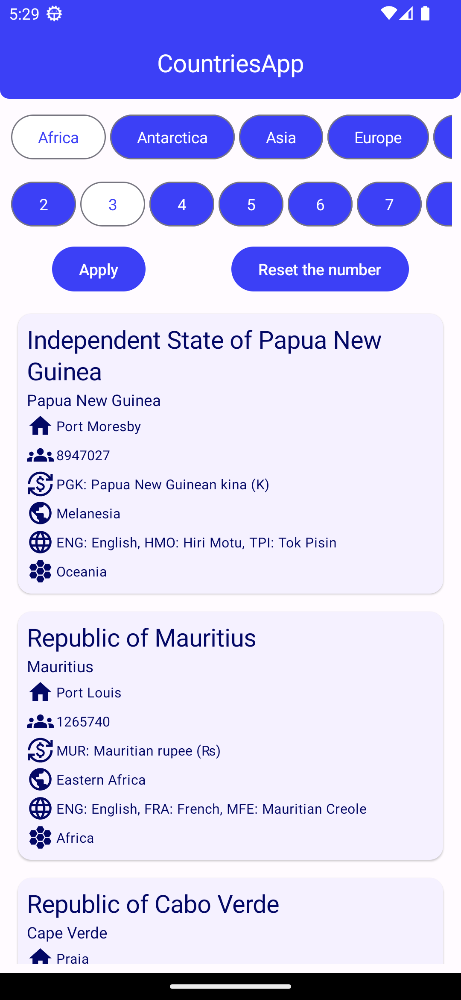
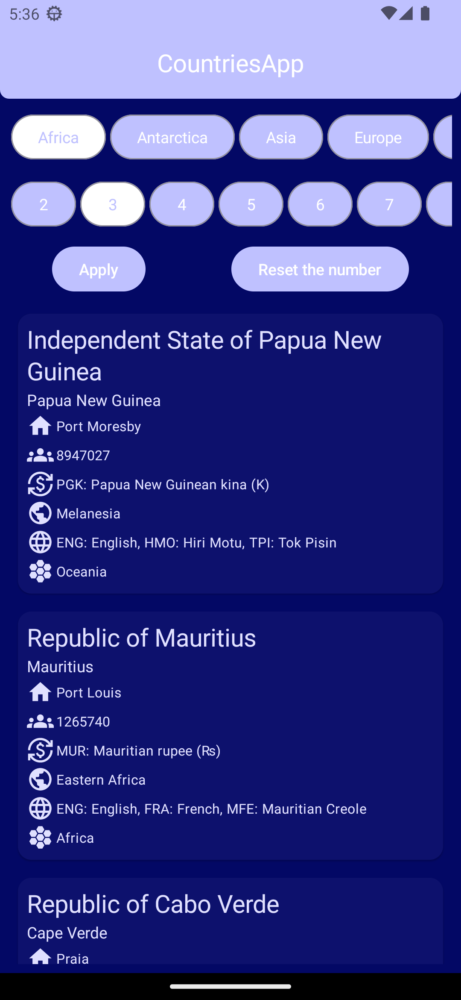

# Countries App

In this application, it is aimed to obtain information about the countries in the continent you have chosen. In addition, when you mark how many countries you want to see, the information of that many countries is shown randomly.


## Installation

Install Countries app with github

1. On GitHub.com, navigate to the main page of the repository.
https://github.com/wenubey/CountriesApp.git

2. Above the list of files, click  Code.



3. Copy the URL for the repository.



To clone the repository using HTTPS, under "HTTPS", click .

To clone the repository using an SSH key, including a certificate issued by your organization's SSH certificate authority, click SSH, then click .

To clone a repository using GitHub CLI, click GitHub CLI, then click .

4. Open Git Bash.

5. Change the current working directory to the location where you want the cloned directory.

6. Type git clone, and then paste the URL you copied earlier.

```bash
  $ git clone https://github.com/wenubey/CountriesApp.git
```

7. Press Enter to create your local clone.

```bash
$ git clone https://github.com/wenubey/CountriesApp.git
> Cloning into `CountriesApp`...
> remote: Counting objects: 10, done.
> remote: Compressing objects: 100% (8/8), done.
> remove: Total 10 (delta 1), reused 10 (delta 1)
> Unpacking objects: 100% (10/10), done.
```

## Use Android Studio

1. Open your Android Studio then go to the File > New > Project from Version Control.



2. After clicking on the Project from Version Control a pop-up screen will arise like below. In the Version control choose Git from the drop-down menu. 



3. Then at last paste the link in the URL and choose your Directory. Click on the Clone button and you are done.

## Deploy app

1. Click the run button.




## Screenshots




    
